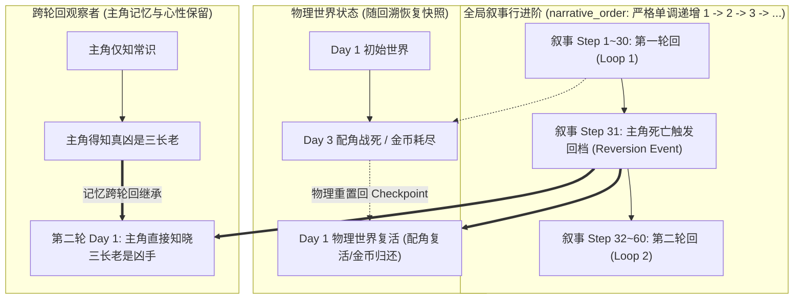
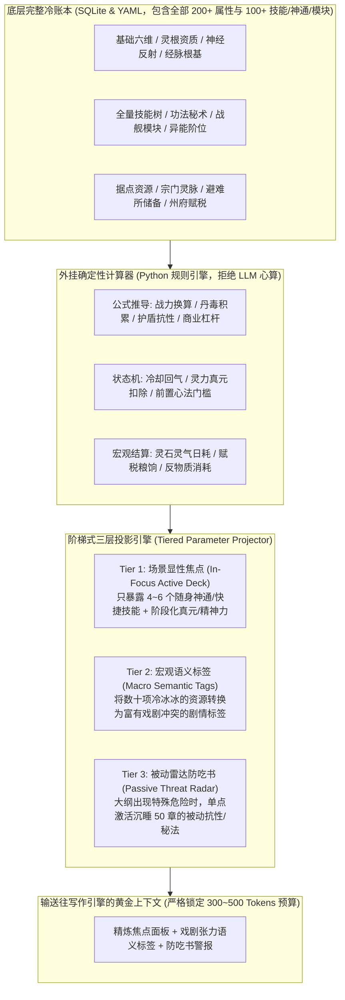

# 01 系统全景架构与双系统协同设计

> 状态：`PLANNED`

---

## 1. 双系统协同全景与数据流闭环

整个写作辅助体系由两个独立工程有机协同构成：
1. **`d:\Code\novel-Skill`（外部学习与写作引擎）**：专注“规律提炼、评测检验、章纲编排与正文创作”；
2. **`d:\Code\Fxi`（知识库与创作数据底座，本项目）**：专注“长期资产存储、世界观事实、动态状态账本、分歧点阻断、视点过滤与检索加速”。

```mermaid
graph LR
    subgraph Engine["写作学习与生成引擎 (D:\\Code\\novel-Skill)"]
        Learn["提取分析与候选归纳<br>(distillation / fingerprint)"]
        Validate["留出验证与行为评测<br>(holdout / probes)"]
        Write["章纲推演与正文起草<br>(outline / writing_workflow)"]
    end

    subgraph Hub["知识库与创作数据中心 (D:\\Code\\Fxi)"]
        subgraph Storage["纯文本单真理源 (Text-First)"]
            SkillsRepo["技能与反面教条库<br>(skills/ / materials/)"]
            WorksRepo["作品正文与草稿仓库<br>(projects/<work-id>/)"]
            SourcesRepo["原著与参考资料底本<br>(sources/)"]
        end
        
        subgraph Services["知识服务与状态引擎"]
            Ledger["动态状态账本 (金币/战力)"]
            Timeline["时空因果 DAG & POD 分歧点"]
            POV["视点防穿帮认知过滤"]
            FTS["jieba + FTS5 中文检索"]
            ModelGW["内部统一模型网关 (model-gateway)"]
        end
    end

    %% 流程 1: 学习成果入库
    SourcesRepo -->|读取样本文本| Learn
    Learn --> Validate
    Validate -->|1. 晋升发布成果| SkillsRepo

    %% 流程 2: 写作检索与上下文
    WorksRepo -.->|2a. 当前故事进度| Write
    SkillsRepo -->|2b. 注入文风与反面教条| Write
    Services -->|2c. 场景化上下文剪枝 (2500~4000 tokens)| Write

    %% 流程 3: 写作产物落盘与入库
    Write -->|3. 保存正文草稿与章节状态| WorksRepo
    WorksRepo -->|4. 增量解析与事件计算| Services
```

---

## 2. 三大业务数据流向闭环

### 2.1 学习成果入库闭环（Learning Distillation Loop）
1. `novel-Skill` 从 `Fxi/sources/` 读取参考小说文本，运行风格蒸馏（`style_distillation.py`）与行为探针；
2. 提炼出的候选经验经过严格的未见章节留出验证（Holdout Validation）与人工审核；
3. 一旦通过验证并执行发布（`publish`），学习成果直接持久化写入 `Fxi` 的相应目录：
   - 写作技法与规则清单 $\rightarrow$ `Fxi/skills/<skill-slug>/rules.yaml`
   - 负向行文禁令 $\rightarrow$ `Fxi/skills/<skill-slug>/anti_patterns.yaml`
   - 典型金手指与桥段素材 $\rightarrow$ `Fxi/materials/<category>/`
   - 规范化主张与可信度评级 $\rightarrow$ `Fxi` 的 SQLite `claims` 与 `claim_evidence` 表。

### 2.2 正文创作与上下文服务闭环（Writing Context Loop）
1. 作者在 `novel-Skill` 中启动章节写作（如 `novel_cli.py write --work-id chusheng --chapter 51`）；
2. `novel-Skill` 向 `Fxi` 发起上下文组装请求（`POST /v1/context/assemble`），携带当前场景信息：
   - `project_id`: "chusheng"
   - `scene_uuid`: "sc_cliff_confrontation_01"
   - `pov_character_id`: "char_villain_01"（当前观察者视点）
   - `scene_type`: "combat"
   - `context_budget`: 3500（Token 预算上限）
3. `Fxi` 检索服务执行多级剪枝管道：
   - **分歧点阻断（POD）**：若为同人作品，切断原著在分歧点后的动态情节事件；
   - **视点过滤（POV）**：物理剔除观察者尚未获知的主角机密底牌；
   - **状态账本结算**：计算当前场景开始时刻角色的金币、伤势与战力快照；
   - **场景化剪枝**：战斗场景自动剔除长篇大论的环境描写，优先返回技能冷却与招式负面约束；
4. `Fxi` 将纯净、结构化、无视点穿帮的上下文数据包返回给 `novel-Skill`。

### 2.3 作品产物持久化与状态更新闭环（Works Persistence Loop）
1. `novel-Skill` 结合上下文生成并完成质量门禁审查后，产物直接保存回 `Fxi` 对应的作品目录：
   - 章节正文 $\rightarrow$ `Fxi/projects/<work-id>/chapters/ch_<id>/draft.md`
   - 章节大纲与元数据 $\rightarrow$ `Fxi/projects/<work-id>/chapters/ch_<id>/metadata.json`
   - 待确认状态增量 $\rightarrow$ `Fxi/projects/<work-id>/chapters/ch_<id>/state-delta.json`
2. `Fxi` 监测到正文落盘后，自动触发轻量增量解析：
   - 本地 CPU 执行 jieba 增量分词，写入 SQLite FTS5 全文索引（<10ms）；
   - 确认的 `state-delta` 自动追加为不可变的 `state_event`，动态状态账本实时生效；
   - 关联的伏笔状态从 `planted` 跃迁为 `hinted` 或 `resolved`。

---

## 3. Fxi 内部五层架构体系

```text
┌─────────────────────────────────────────────────────────────────────────────┐
│ 1. 接入与表现层 (API / CLI / Stdio)                                         │
│    • CLI 入口 (kb 命令体系)               • 本地 JSON REST API (/v1)        │
│    • novel-Skill 专属适配桥接器           • 只读安全与错误码转化器          │
├─────────────────────────────────────────────────────────────────────────────┤
│ 2. 领域逻辑与审查层 (Domain Engine)                                         │
│    • 故事实体 (人物/物品/能力/地点/事件)  • 命题四层模型 (主张/断言/证据)    │
│    • 动态状态账本 (State Ledger: 三态数值) • 时空因果 DAG & POD 分歧点阻断    │
│    • 角色认知追踪 & POV 盲区过滤          • 四级软删除生命周期管控引擎       │
├─────────────────────────────────────────────────────────────────────────────┤
│ 3. 检索与分词加速层 (Retrieval & Index Engine)                              │
│    • jieba 中文分词 + 项目专有词典加载    • SQLite FTS5 全文检索虚表         │
│    • 本地 Qwen3-Embedding-0.6B (1.5GB)    • 场景化上下文剪枝器 (Token 黄金预算)│
├─────────────────────────────────────────────────────────────────────────────┤
│ 4. 统一大模型网关层 (Model Gateway Infrastructure)                         │
│    • 任务分级路由器 (models.yaml)         • 结构化容错修复 (json_repair)    │
│    • 调用哈希缓存 (LLM Cache: 0 成本命中) • 审计与 Token 费用记账本          │
│    • 提示词模板外部化 (prompts/ 独立管理) • 离线优雅降级队列                │
├─────────────────────────────────────────────────────────────────────────────┤
│ 5. 存储与真理源底座 (Storage & Persistence Layer)                           │
│    • 纯文本真理源: Markdown + YAML Frontmatter (projects/, skills/, sources/)│
│    • SQLite 派生加速库 (manifest.sqlite: 可通过 kb rebuild 100% 重建)        │
└─────────────────────────────────────────────────────────────────────────────┘
```

---

## 4. 跨工程边界与协议约束

1. **协议轻量化与本地优先**：`Fxi` 与 `novel-Skill` 均运行在同一台 Windows 开发机上。通信推荐优先采用标准本地 REST API（`http://127.0.0.1:8765/v1`）或标准 CLI 子进程调用，彻底避免由于跨项目 Python 虚拟环境依赖冲突带来的排错痛苦；
2. **只读保护与写回审查**：`novel-Skill` 在写作阶段对 `Fxi` 核心数据为严格只读；正文产生的新事实、新金币消耗必须以 `state-delta.json` 或 `proposal` 形式提交，经作者确认后才正式沉淀为不可变事实；
3. **硬件资源互斥保护**：
   - `Fxi` 的 Qwen3-Embedding-0.6B 常驻 GPU 显存约 1.5GB；
   - `novel-Skill` 写作与提炼建议调用云端 API（DeepSeek / Gemini），严禁在本地同时强行启动 7B/14B 生成模型，死守 RTX 2060 6GB 显存红线。

---

## 5. 主角能力回档与时间循环机制（Time Reversion & Loop Resilience）

网络小说中常见“死亡回档”、“时间循环（Re:Zero 流）”或“读档外挂”。若数据库设计不当，时间倒流会导致时序因果成环、状态覆盖和逻辑错乱。`Fxi` 采用数学上严格完备的**双重时间坐标与保留观察者模型**：



### 5.1 双重时间坐标解耦（杜绝因果 DAG 成环）
1. **故事物理日历时间（`physical_time`，可倒流）**：故事世界内的日历时间，从“五月初三”跳回“五月初一”；
2. **观察者因果叙事步（`narrative_order`，永远单调递增）**：第一轮死战发生在 Step 20，回溯发生在 Step 21，第二轮重生开始于 Step 22。
   - **数学结论**：因果边一律基于 `narrative_order` 建立单向有向边，因果图永远保持严格的**有向无环图（DAG）**，无论主角回档 100 次，底层因果也绝不会出现死锁循环！

### 5.2 物理世界快照重置 vs 观察者记忆继承
- **物理世界还原**：除主角外的其他角色存亡、金币账本、装备归属与周围环境，一律从 `reversion_checkpoints` 恢复快照（配角起死回生，花掉的金币重新回到荷包）；
- **保留观察者（Retained Entities）**：声明了保留记忆的主角（`retained_entities: ["char_protagonist"]`），其认知状态（`knowledge_state`）、心理相态（如经历死亡后的黑化相态 `phase_mid_blackened`）跨轮回累加继承。

### 5.3 原创与同人使用时的隔离保证
- **原创作品多轮回推演**：利用 `timelines` 表开启多分支（如 `loop_1`, `loop_2`），旧轮回数据标记为归档历史，写作上下文仅加载当前激活的活跃时间线，历史轮回可用于剧情复盘与伏笔对比；
- **同人作品的主角回档外挂**：
  - 同人从原著切入点建立分歧点（POD）；
  - 主角在同人内部即使反复回档，所有分支和回滚严格收敛在同人项目 `work_id` 的专属时间线沙箱中；
  - **绝不影响原著底本，也绝不会让原著事实产生倒流冲突**。数据、关系与账本 100% 自洽无错乱！

---

## 6. 泛题材全通用的能力机制与据点基业架构（Genre-Agnostic Mechanics & Holdings Engine）

用户常以“游戏文数值”或“领主流资源”举例，但**在底层数学与叙事模型上，这一套逻辑完全放之所有小说题材皆准**。无论是修仙的宗门与神通、科幻的战舰与空间站、历史争霸的州府与赋税、末世的避难所与异能，还是诡秘序列的魔药与代价，其底层本质全都是：
1. **微观实体能力与消耗约束**（技能/神通/异能/模块 + 蓝耗/真元/反噬/冷却）；
2. **宏观组织资产与产耗动力学**（领地/宗门/基地/州府 + 粮食/灵石/军饷/稀土）；
3. **海量冷参数防吃书与防 Prompt 挤爆**（三层阶梯投影 + 外挂计算器 + 被动威胁雷达）。

### 6.1 全题材全景映射矩阵（One Engine for All Genres）

| 题材类型 | 微观能力流（通用技能树抽象） | 资源池与冷却约束（通用能量抽象） | 宏观据点资产（通用建筑拓扑抽象） | 宏观资源产耗（通用经济账本抽象） | 剧作语义张力标签（Macro Tags 转化） |
|:---|:---|:---|:---|:---|:---|
| **游戏 / 升级流** | 职业阶位、主动/被动技能、装备词条 | 魔法值(MP)、技能CD、耐力负重 | 领地城邦、铁匠铺、魔法塔、城墙 | 金币、木材、石料、魔晶、粮食 | `[城防残破]`、`[大招冷却中]` |
| **修仙 / 玄幻** | 境界层次、功法心法、神通秘术、本命法宝 | 真元灵力、雷劫间隔、心魔反噬、寿元 | 宗门洞府、护山大阵、灵脉灵田、藏经阁 | 下品/极品灵石、灵草丹药、宗门贡献点 | `[大阵灵力告罄]`、`[寿元将尽]` |
| **科幻 / 机甲 / 星际** | 舰载模块、机甲突触连接、电子战特技 | 反应堆功率、护盾过载衰减、主炮充能步长 | 轨道空间站、恒星基地、殖民星生态穹顶 | 稀土矿、反物质燃料、合金钢材、人口配额 | `[维生氧气告急]`、`[护盾过载]` |
| **历史 / 争霸 / 种田** | 官职品阶、统帅智谋特技、门生人脉关系 | 军令疲劳、政令下达周期、私库库银 | 封邑州府、水利运河、营房粮仓、城池关隘 | 军粮赋税、生铁战马、漕运耗损、民夫徭役 | `[秋粮欠收]`、`[营中哗变预兆]` |
| **末世 / 废土 / 丧尸** | 异能阶位、基因锁阶段、变异器官 | 精神力阈值、辐射侵蚀度、狂暴反噬 | 幸存者地下避难所、发电站、净水工坊 | 纯净水、抗生素、高能晶核、无污染口粮 | `[净水滤芯故障]`、`[尸潮来袭]` |
| **诡秘 / 序列魔药** | 序列途径、魔药技能、非凡特质 | 疯狂/理智(San)、魔药消化度、负面代价计时 | 隐秘隐蔽所、塔罗会/隐秘聚会点、仪式法阵 | 主辅材料、非凡特性、金镑、封印物代偿 | `[失控边缘]`、`[封印物反噬倒计时]` |
| **都市 / 商业神豪** | 商业特权、系统返现特权、社会声望 | 系统每日额度、资金杠杆率、技能回转日 | 商业帝国、旗下控股公司、产业基地、院线 | 现金流净额、股票市值、银行授信、负债率 | `[资金链断裂预警]`、`[恶意做空]` |

### 6.2 架构通用的四大设计支柱



1. **防上下文撑爆（Anti-Bloat）**：把动辄上千字的宗门/领地/人物全量面板，压缩成 300~500 Tokens 的场景焦点，把上下文空间彻底留给文笔、剧情张力与对白；
2. **防大模型心算幻觉（Anti-Hallucination）**：真元消耗、灵石结算、军粮动销、技能回气全部由 Python 确定性逻辑执行，大模型只负责自然语言叙事；
3. **冷参数防吃书雷达（Passive Threat Radar）**：主角在第 5 章获得的抗性或收服的残魂，即使 80 章未提及，当特定威胁出现时依然会被雷达精准召回，杜绝设定打脸；
4. **统一抽象杜绝重复造轮子**：一套底层引擎支撑玄幻、科幻、历史、末世、都市所有题材，绝不为每个题材写一套孤立的代码。

