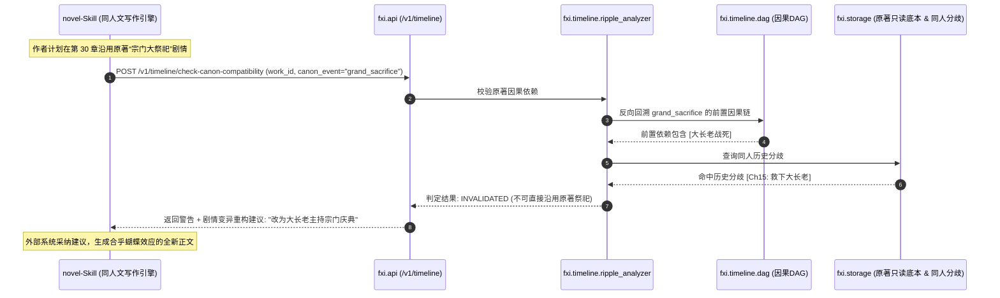

# 03 模块清单与具体代码文件职责划分 (生产级全景设计)

---

## 1. 架构包层级全览 (15 个核心子包)

`src/fxi/` 严格遵循单向依赖与职责内聚原则，划分为 15 个独立子包。从底层基础设施、因果图拓扑、蝴蝶效应分析、泛题材微观/宏观规则引擎，到大模型网关与 API 接口，实现全链路覆盖：

```text
src/fxi/
├── core/                   # 1. 基础内核 (全局配置、跨子包通用枚举、不可变数据载荷、全局异常树)
├── storage/                # 2. 存储引擎 (YAML Frontmatter 原子读写、SQLite WAL 客户端、一键全量重建)
├── sources/                # 3. 原始底本切片 (参考原著底本导入、场景语义 UUID 锚点、分词准备)
├── domain/                 # 4. 故事核心模型 (实体生命周期、性格阶段演变、量产/唯一法宝、所有权流转)
├── claims/                 # 5. 主张与可信度 (四层命题系统、审核自动分流、合法吃书 Retcon)
├── timeline/               # 6. 时空因果与蝴蝶效应 (因果 DAG、蝴蝶效应涟漪分析、同人 POD 阻断、轮回快照)
├── character_knowledge/    # 7. 角色认知与防穿帮 (视点 POV 过滤、已知事实差集、跨循环情报注入)
├── state_ledger/           # 8. 动态状态通用账本 (三态数值模型、中途接入基准锚点、变动事件流)
├── game_engine/            # 9. 【微观实体能力与规则引擎】全题材通用 (属性换算、技能树与冷却、阶梯投影、防吃书雷达)
├── territory/              # 10.【宏观据点基业动力学引擎】全题材通用 (资源日结算、建筑依赖 DAG、人口民心、宏观语义标签)
├── materials_skills/       # 11. 技法与反面教条 (写作规则库、负向禁写词库、来自 novel-Skill 的发布接收器)
├── index_retrieval/        # 12. 检索与上下文剪枝 (jieba+FTS5、专业词表导出、2500~4000 黄金预算剪枝)
├── model_gateway/          # 13. 大模型统一网关 (任务分流路由、JSON 容错修复、SHA-256 结果缓存、用量成本)
├── api/                    # 14. 本地 REST 服务 (FastAPI 端点声明、蝴蝶效应查询端点、Pydantic 契约)
└── cli/                    # 15. 命令行系统 (Click/Typer 命令族: kb rebuild / search / state / ripple / audit)
```

---

## 2. 详细文件清单、类定义与函数级契约

---

### 2.1 `src/fxi/core/`（基础内核与统一契约）

#### `config.py`
* **类定义**：
  ```python
  class FxiConfig(BaseModel):
      workspace_root: Path
      data_dir: Path
      projects_dir: Path
      skills_dir: Path
      sources_dir: Path
      sqlite_path: Path
      cache_db_path: Path
      default_context_budget: int = 3500
      max_context_budget: int = 4000
      vram_safe_limit_mb: int = 2048
      jieba_custom_dict_path: Path
  ```
* **核心函数**：
  * `def load_config(config_file: Optional[Path] = None) -> FxiConfig`: 加载 YAML 并自动创建缺失目录。

#### `exceptions.py`
* **异常继承树**：
  ```text
  FxiError (基类)
  ├── StorageError (存储读写、文件占用、权限问题)
  │   ├── FileLockedError (文件被外部程序修改守卫触发)
  │   └── CorruptedDataError (纯文本损坏或 YAML 格式非法)
  ├── ValidationError (数据契约强校验不通过)
  ├── GatewayError (模型调用失败)
  │   ├── ModelTimeoutError
  │   └── SchemaRepairFailedError (JSON 修复重试后依然无法解析)
  ├── RuleViolationError (领域与规则校验失败)
  │   ├── OOCConflictError (角色言行与性格/认知阶段严重背离)
  │   ├── CausalConflictError (试图沿用已在同人中失效的原著因果)
  │   ├── ResourceDeficitError (领地/宗门资源不足导致升级/调兵非法)
  │   ├── SkillCastIllegalError (蓝量/真元透支、冷却未好、前置未解锁)
  │   └── OwnershipConflictError (试图操作已赠出或被夺走的法宝)
  └── NotFoundError (实体、章节、时间线或快照不存在)
  ```

#### `types.py`
* **核心枚举**：
  ```python
  class SceneType(str, Enum):
      COMBAT = "combat"           # 战斗厮杀 (聚焦技能冷却、血量、招式禁令)
      DIALOGUE = "dialogue"       # 对话博弈 (聚焦角色秘密、性格阶段、视点防穿帮)
      TERRITORY = "territory"     # 领地治理 (聚焦宏观资源状态、民心动向、建筑进度)
      CULTIVATION = "cultivation" # 闭关修炼 (聚焦境界突破、功法心魔、丹药消耗)
      EXPLORATION = "exploration" # 秘境探索 (聚焦地图机制、物品储物袋、环境禁忌)

  class CausalStatus(str, Enum):
      UNTOUCHED = "untouched"     # 原著基石: 未受同人变动波及，可 100% 沿用
      MUTATED = "mutated"         # 受到波及: 核心事件发生，但参与人/时间/地点发生异化
      INVALIDATED = "invalidated" # 彻底失效: 前置因果已被同人修改，本事件不可再发生
  ```

---

### 2.2 `src/fxi/storage/`（存储引擎与单真理源）

#### `text_io.py`
* `read_markdown_frontmatter(path: Path) -> tuple[dict, str]`: UTF-8 编码安全读取 YAML Frontmatter。
* `write_markdown_frontmatter(path: Path, metadata: dict, body: str, guard_hash: Optional[str] = None) -> str`: 原子覆写并执行冲突守卫（`FileLockedError`）。

#### `sqlite_client.py`
* `DatabaseClient`: 管理 SQLite 连接池，启用 WAL 模式与外键约束。

#### `rebuild.py`
* `Rebuilder.rebuild_all() -> RebuildReport`: 15 秒内从纯文本 Markdown/YAML 重建全部索引与因果关系。

---

### 2.3 `src/fxi/sources/`（原始底本与切片）

#### `importer.py`
* `SourceImporter.import_file(path, source_id, project_id) -> SourceManifest`: 导入参考底本，计算 SHA-256。
#### `segmenter.py`
* `TextSegmenter.split_into_scenes(text: str) -> list[SceneChunk]`: 将原著切分为 512~1024 字符的高聚合语义场景。
#### `scene_id.py`
* `generate_scene_uuid(source_id, chapter_num, scene_seq) -> str`: 生成物理章号重排抗脆性的确定性场景 UUID。

---

### 2.4 `src/fxi/domain/`（故事核心模型）

#### `entities.py`
* `EntityManager`: 人物卡、宗门地理、道具实体的持久化增删查改。
#### `phases.py`
* `PhaseManager.get_active_phase(entity_id, narrative_order) -> EntityPhase`: 动态获取当前叙事步长下角色的性格相态（隐忍 vs 黑化）与语气范例。
#### `items.py`
* `ItemManager`: 原型模板（量产通用）与实体孤品（神兵至宝）二分管理。
#### `ownership.py`
* `OwnershipTracker.transfer_ownership(...)`: 记录神兵归属流转事件（LOOTED, GIFTED, STOLEN, DESTROYED），杜绝归属穿帮。

---

### 2.5 `src/fxi/claims/`（主张模型与合法吃书）

#### `models.py`
* 命题、主张版本、证据行号与读者判断解耦的四层模型。
#### `triage.py`
* `TriageEngine.classify(claim: CandidateClaim) -> TriageResult`: 自动分流无争议事实与待审冲突项。
#### `retcon.py`
* `RetconManager.declare_retcon(...)`: 合法吃书声明引擎，自动通知下游 OOC 检查豁免报警。

---

### 2.6 `src/fxi/timeline/`（时空因果、蝴蝶效应与回档引擎）

#### `dag.py`（因果有向无环图）
* **核心类与方法**：
  ```python
  class CausalDAG:
      def add_causal_link(self, cause_event_id: str, effect_event_id: str, link_type: str = "direct_cause") -> None:
          """在 SQLite causal_links 表中注册前置因果依赖"""
      def get_ancestors(self, event_id: str) -> set[str]:
          """反向查询一个事件发生所依赖的所有前置因果事件集合"""
      def get_descendants(self, event_id: str) -> set[str]:
          """正向查询一个事件向下游扩散的所有可能波及的事件集合"""
  ```

#### `ripple_analyzer.py`（【蝴蝶效应深度分析器】专供同人文协同）
* **核心类与方法**：
  ```python
  @dataclass
  class RippleImpactTree:
      divergence_event_id: str
      invalidated_canon_events: list[dict] # 必须阻断的原著事件 (前置依赖破损)
      mutated_canon_events: list[dict]      # 受到波及发生异化的原著事件
      affected_characters: list[str]        # 命运发生偏折的角色清单
      suggested_alternatives: list[str]     # 给外部写作引擎的剧情重构推演建议

  class RippleAnalyzer:
      def analyze_divergence(self, work_id: str, divergence_event_id: str) -> RippleImpactTree:
          """
          【计算同人变动向下游扩散的蝴蝶效应涟漪树】：
          1. 提取该分歧事件在原著中所颠覆的原著事件 E_canon (如: 救下大长老颠覆了大长老战死);
          2. 从 E_canon 出发沿 CausalDAG 进行宽度优先搜索 (BFS);
          3. 凡强依赖于 E_canon 的下游事件标记为 INVALIDATED;
          4. 凡弱依赖或共享参与角色的事件标记为 MUTATED;
          5. 生成蝴蝶效应影响报告，供外部写作系统精准调用！
          """
      def check_canon_compatibility(self, work_id: str, intended_canon_event_id: str) -> tuple[CausalStatus, str]:
          """
          【外部项目沿用原著剧情时的防吃书预检】：
          输入作者即将写的原著事件 ID，自动检测其所有前置因果：
          - 若任一前置因果已被同人修改/消灭 -> 返回 (INVALIDATED, "前置事件[大长老阵亡]已在Ch15被救下，本剧情已不可再发生！");
          - 若前置因果部分变更 -> 返回 (MUTATED, "建议让大长老代替二长老主持宗门比武");
          - 若前置因果完好 -> 返回 (UNTOUCHED, "原著事件安全，可直接沿用").
          """
      def get_chapter_canon_diff(self, work_id: str, canon_chapter_index: int) -> dict[str, Any]:
          """为外部写作系统组装当前章节的原著对照与蝴蝶效应提示包"""
  ```

#### `pod_filter.py`（同人分歧点阻断器）
* `filter_canon_events(work_id, canon_events) -> list[Event]`: 物理阻断分歧点后的原著动态事件，保留静态世界法则。

#### `reversion.py`（死亡回档与循环快照）
* `TimeReversionManager`: 拍摄与还原物理世界快照，跨循环继承主角特权记忆。

---

### 2.7 `src/fxi/character_knowledge/`（认知与视点防穿帮）

#### `pov_filter.py`
* `sanitize_context_for_pov(context_bundle, pov_char) -> dict`: 物理剥离观察者未知秘密，严防视点穿帮。
#### `ooc_checker.py`
* `OOCChecker.scan_draft(draft_text, story_time) -> OOCReport`: 扫描草稿对白与动作，比对认知阶段防 OOC。

---

### 2.8 `src/fxi/state_ledger/`（动态状态通用账本）

#### `calculator.py`
* `LedgerCalculator.calculate_balance(...)`: 派生快照计算器，支持中途修改剧情后的极速全量重算。
#### `anchor.py`
* `AnchorManager.create_baseline_anchor(...)`: 支持中途设定基准锚点，零历史包袱向前冻结为 `UNMEASURED`。

---

### 2.9 `src/fxi/game_engine/`（【微观实体能力与规则引擎】全题材通用）

> 通用支持：游戏技能、修仙神通、科幻机甲模块、末世异能、诡秘魔药。

* `attributes.py`: 基础属性向派生属性（战力/负荷/法强）的确定性公式换算。
* `skills.py`: `SkillTreeEngine.validate_cast`: 严格校验冷却步长、能量扣除、前置心法门槛。
* `projection.py`: `TieredParameterProjector`: 战斗场景只暴露 4~6 项快捷技能，控在 400 Tokens 内。
* `passive_radar.py`: `PassiveThreatRadar`: 大纲遇特定危险时，精准唤醒沉睡 80 章的冷门抗性/神通防吃书。

---

### 2.10 `src/fxi/territory/`（【宏观据点基业动力学引擎】全题材通用）

> 通用支持：领地城邦、修仙宗门洞府、科幻空间站/母舰、末世避难所、历史封邑州府。

* `resources.py`: `TerritoryResourceManager`: 粮食/灵石/军饷/稀土的每日净产出与仓储结算。
* `buildings.py`: 建筑树前置依赖 DAG 校验与工期队列。
* `macro_tags.py`: `MacroTagGenerator`: 将内部数值转换为 `[粮饷危急]`、`[大阵灵力告罄]` 等戏剧张力标签。

---

### 2.11 `src/fxi/materials_skills/`（写作技法与反面教条）

* `skill_store.py`: 加载高分技法规则。
* `anti_patterns.py`: 负向禁写教条库检索。
* `distillation_receiver.py`: 接收 `novel-Skill` 发布成果并规范化落盘。

---

### 2.12 `src/fxi/index_retrieval/`（分词检索与场景剪枝）

* `jieba_fts.py`: 中文预分词 SQLite FTS5 检索虚表。
* `context_pruner.py`: `ContextPruner.assemble_and_prune`: 将总 Token 控制在 2500~4000 黄金区间。

---

### 2.13 `src/fxi/model_gateway/`（大模型统一网关）

* `gateway.py`: 路由、SQLite SHA-256 缓存（0ms 0元）、`json_repair` 自动修复强类型解析。

---

### 2.14 `src/fxi/api/`（本地 REST 服务与蝴蝶效应查询端点）

* **端点清单（供 `novel-Skill` 或外部写作系统调用）**：
  * `POST /v1/context/assemble`: 场景化黄金上下文组装（含蝴蝶效应提示）；
  * `POST /v1/timeline/ripple-impact`: 查询某个变动向后扩散的蝴蝶效应影响树；
  * `POST /v1/timeline/check-canon-compatibility`: 预检准备写的原著剧情是否已被同人蝴蝶效应阻断；
  * `POST /v1/timeline/chapter-canon-diff`: 获取某章的原著基石与同人变动对照；
  * `POST /v1/state/query`: 查询角色属性或领地宏观标签；
  * `POST /v1/checks/ooc`: 提交正文草稿进行防穿帮与逻辑审查。

---

### 2.15 `src/fxi/cli/`（命令行系统）

* `kb rebuild`: 一键全量索引重建；
* `kb ripple <work_id> <divergence_event>`: 命令行打印蝴蝶效应扩散树；
* `kb check-canon <work_id> <canon_chapter>`: 校验某章原著兼容性。

---

## 3. 蝴蝶效应在同人创作中的协同流程时序图


