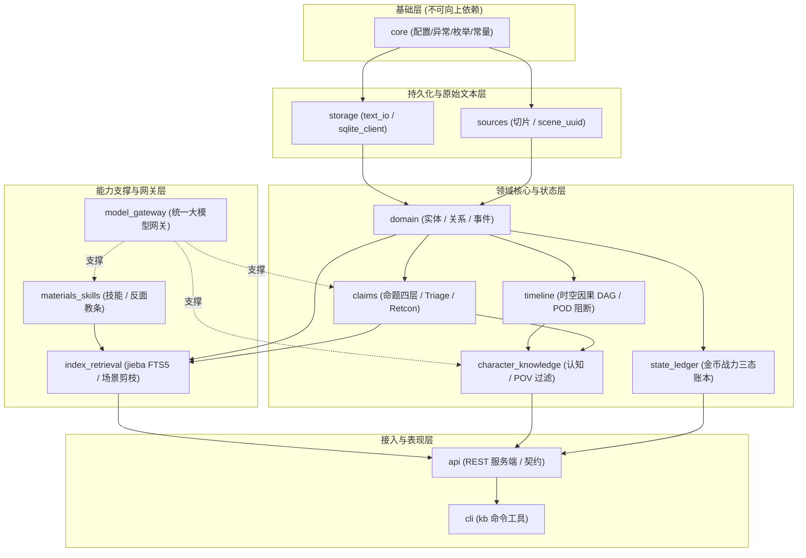

# 04 关联、引用与代码复用设计

---

## 1. Fxi 内部模块依赖关系与调用拓扑

为彻底杜绝 Python 循环导入（Circular Import）和架构混乱，`src/fxi/` 内部各模块必须遵守严格的**分层单向依赖原则**：



### 依赖铁律：
1. `core` 是绝对基础层，严禁引用任何其他业务子包；
2. `storage` 仅提供通用数据存取，严禁包含特定业务规则（如 OOC 判断或金币计算）；
3. `api` 与 `cli` 属于表现层，只能向下调用领域与支撑层，领域层严禁反向引用 `api` 或 `cli`；
4. 凡跨模块复杂逻辑必须通过接口或事件驱动，杜绝 `import *`。

---

## 2. 与 `D:\Code\novel-Skill` 的跨项目复用与契约桥接

`d:\Code\novel-Skill` 已经具备一套非常完善的代码实现（涵盖表结构、环境加载、JSON 容错与契约定义）。在开发 `Fxi` 时，我们**绝不重复造轮子**，而是最大化对其进行规范继承与代码复用。

### 2.1 数据库表结构复用与对齐
`novel-Skill` 在 `knowledge_registry_schema.py` 中已经沉淀了一套高可用 Schema。`Fxi` 的 `data/manifest.sqlite` 直接对齐并兼容其设计：
- `authors`（作者与所有者表）
- `works`（作品元数据表：`work_id`, `owner_id`, `slug`, `genre_ids_json`, `source_dir`, `skill_root` 等）
- `learning_runs` 与 `run_batches`（学习批次与运行审计）
- `claim_families`、`claim_versions` 与 `claim_evidence`（主张家族、多版本与原文行号证据表）
- `knowledge_versions` 与 `knowledge_heads`（生产知识版本与指针）

> **收益**：`novel-Skill` 的 `knowledge_registry.py` 可以直接将其产出的验证主张写入或同步到 `Fxi` 的 SQLite 库中，零数据格式转换成本！

### 2.2 基础工具代码直接复用
`Fxi` 可以直接吸收并复用 `novel-Skill` 中经过实战检验的基础工具：
1. **`secret_env.py`**：安全环境变量与 `.env` 文件加载器，具有安全的密钥脱敏和默认值机制，直接作为 `Fxi/src/fxi/core/env.py` 的基础；
2. **`structured_json.py`**：优秀的 Markdown 围栏剥离、脏 JSON 容错与字典提取工具，直接复用进 `Fxi/src/fxi/model_gateway/repair.py`，再叠加上 Pydantic Schema 强校验；
3. **`chapter_contract.py`** 与 **`context_bundle.py`**：
   - 其中的 `ChapterContract`、`StoryState`、`Fact` 等 Pydantic 数据契约，直接作为 `Fxi` 与 `novel-Skill` 之间的**通用数据通信标准（Single Source of Truth）**。

---

## 3. 双系统跨工程交互模式设计

两套工程既互相协同，又保持解耦。支持以下两种落地调用模式：

### 模式 A：本地 REST API 模式（松耦合推荐，默认方式）
- **运作方式**：`Fxi` 启动本地轻量 HTTP 服务（`uvicorn fxi.api.server:app --port 8765`）；
- `novel-Skill` 通过标准 HTTP 客户端调用：
  ```python
  # novel-Skill 内部调用 Fxi 服务的示例
  response = requests.post(
      "http://127.0.0.1:8765/v1/context/assemble",
      json={
          "project_id": "chusheng",
          "scene_uuid": "sc_cliff_01",
          "pov_character_id": "char_lin_dong",
          "scene_type": "combat",
          "context_budget": 3500
      },
      timeout=5.0
  )
  context_bundle = response.json()["data"]
  ```
- **核心优势**：两个项目各自拥有独立的 Python 虚拟环境，依赖库版本升级完全互不影响，网络中断或服务未启动时拥有明确的 HTTP 状态码。

### 模式 B：可编辑包直调模式（高性能批处理备选）
- **运作方式**：在 `novel-Skill` 的 Python 环境中执行：
  ```powershell
  pip install -e D:\Code\Fxi
  ```
- **代码直调**：
  ```python
  # 在 novel-Skill 脚本中直接引用 Fxi 核心模块
  from fxi.state_ledger.calculator import LedgerCalculator
  from fxi.index_retrieval.jieba_fts import ChineseFTS
  
  calculator = LedgerCalculator(db_path="D:/Code/Fxi/data/manifest.sqlite")
  balance = calculator.calculate_balance("char_lin_dong", "gold", "chapter_51")
  ```
- **适用场景**：上百章长篇大批量留出测试（Holdout Validation）或大规模离线状态重算时，避开 HTTP 序列化开销，直接内存访问。

---

## 4. 学习成果与作品正文落盘协议

为确保 `novel-Skill` 的产物准确进入 `Fxi`，建立明确的落盘协议：

| 业务动作 | `novel-Skill` 发起端命令 | `Fxi` 对应的最终持久化落盘位置 |
|---|---|---|
| **提炼技法并发布** | `python novel_cli.py validate --publish-work` | `Fxi/skills/<skill-slug>/rules.yaml`<br>`Fxi/skills/<skill-slug>/anti_patterns.yaml` |
| **生成章节正文** | `python novel_cli.py write --chapter 51` | `Fxi/projects/<work-id>/chapters/ch_00051/draft.md` |
| **大纲与元数据** | 同上（正文伴生产物） | `Fxi/projects/<work-id>/chapters/ch_00051/metadata.json`<br>`Fxi/projects/<work-id>/chapters/ch_00051/chapter-outline.json` |
| **待确认状态变更** | 同上（金币/战力变动） | `Fxi/projects/<work-id>/chapters/ch_00051/state-delta.json` |
| **更新全局故事状态** | 作者在 CLI 确认增量后 | `Fxi/projects/<work-id>/state/story-state.json` |
